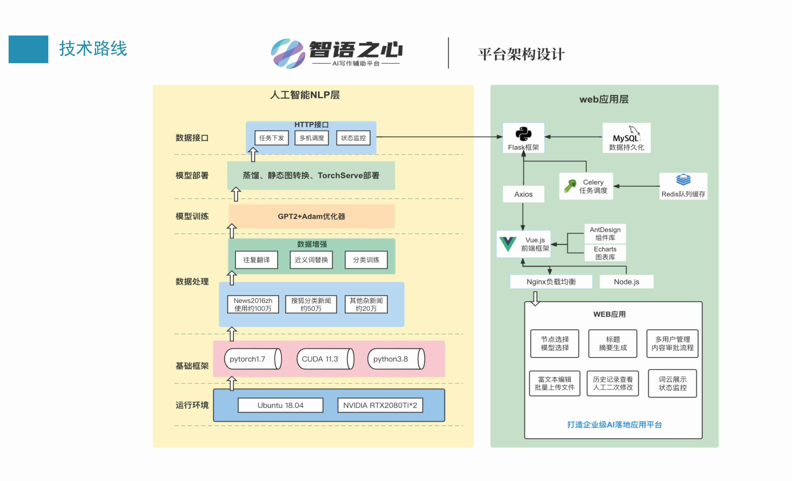
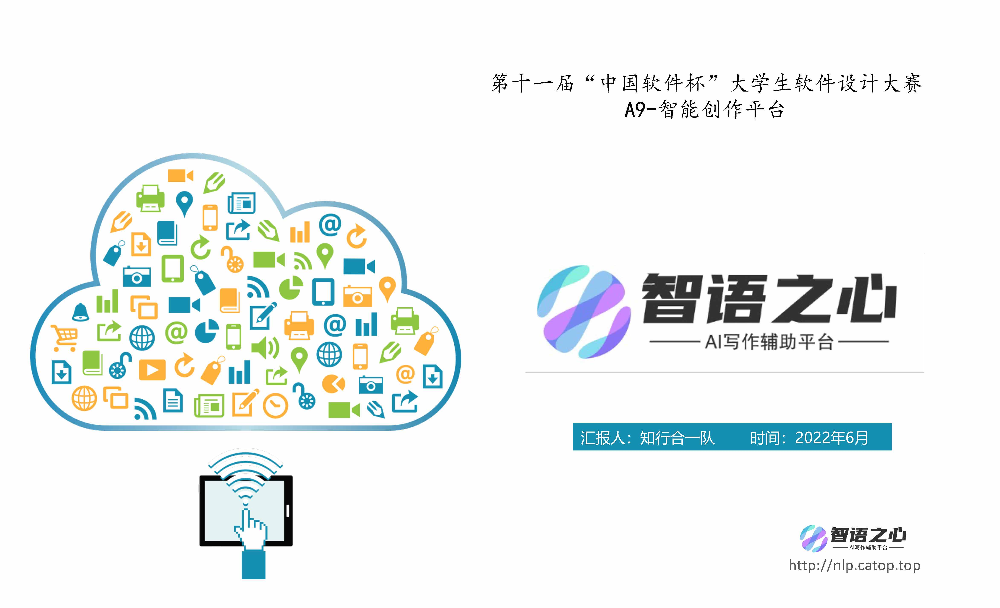
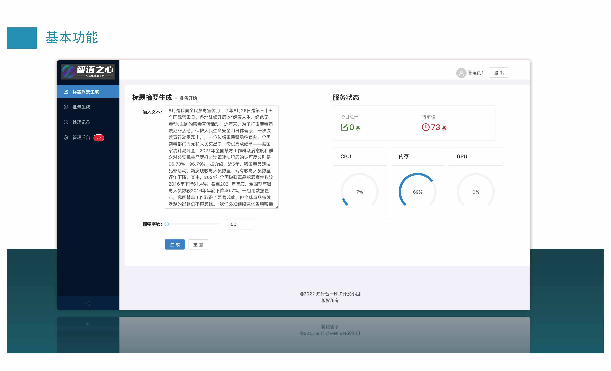
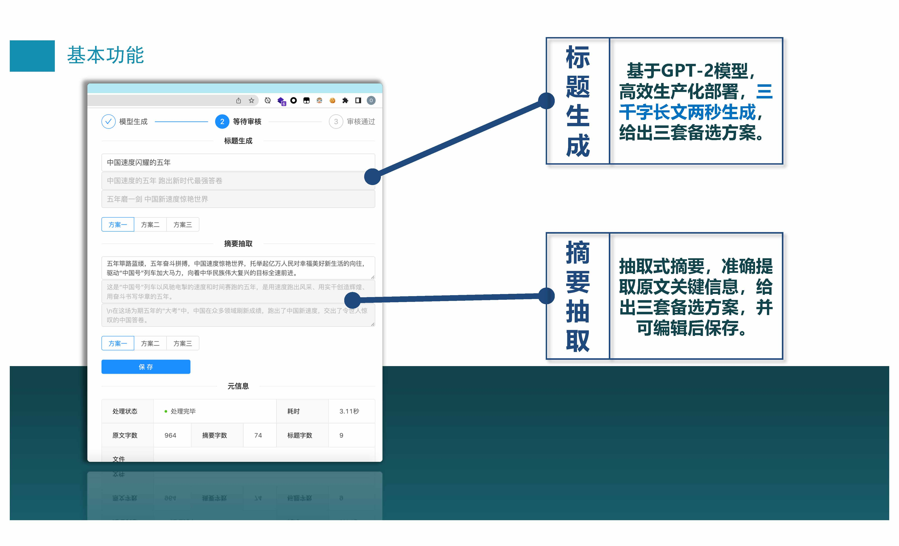
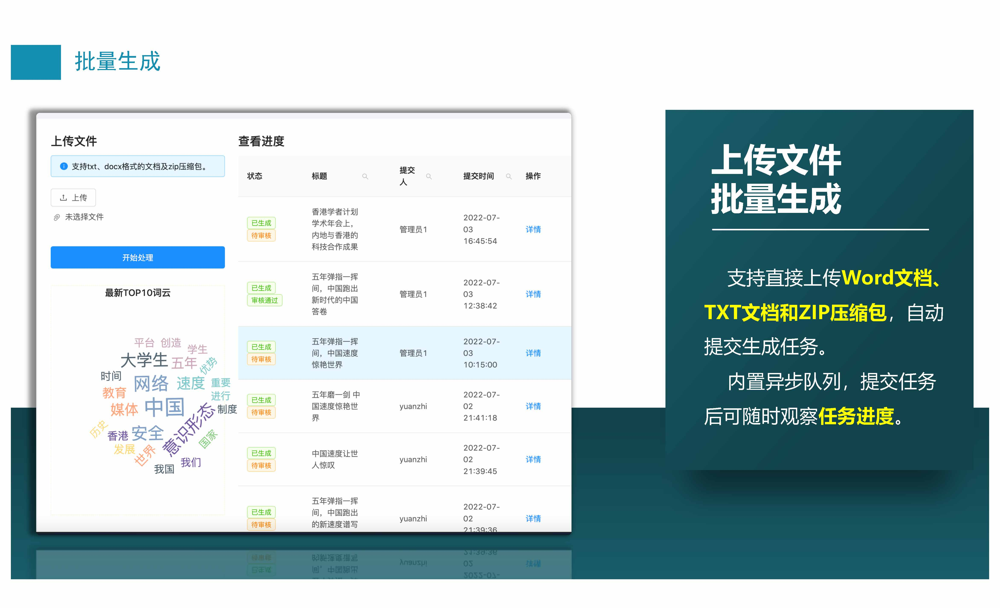
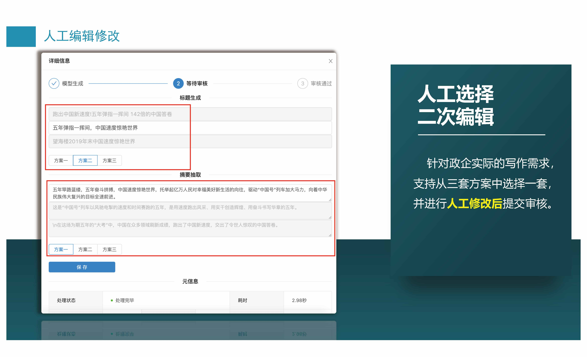
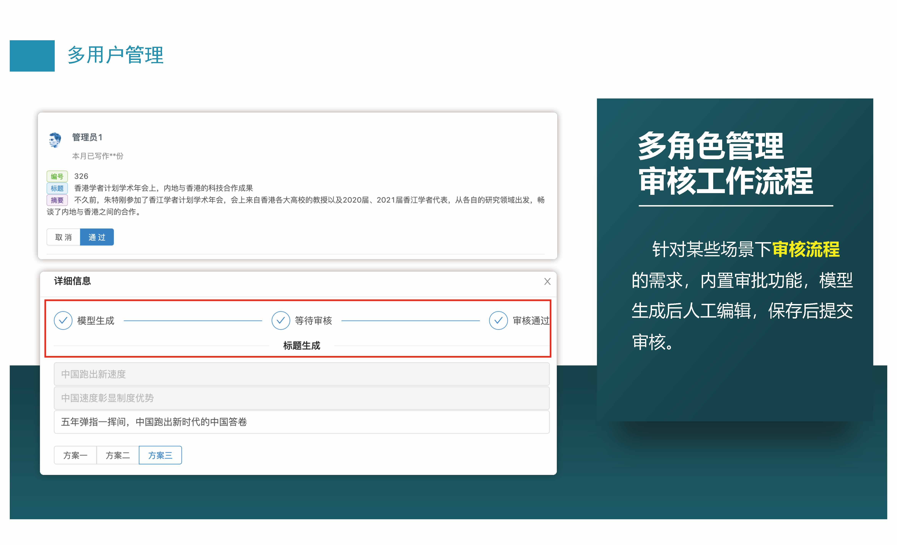
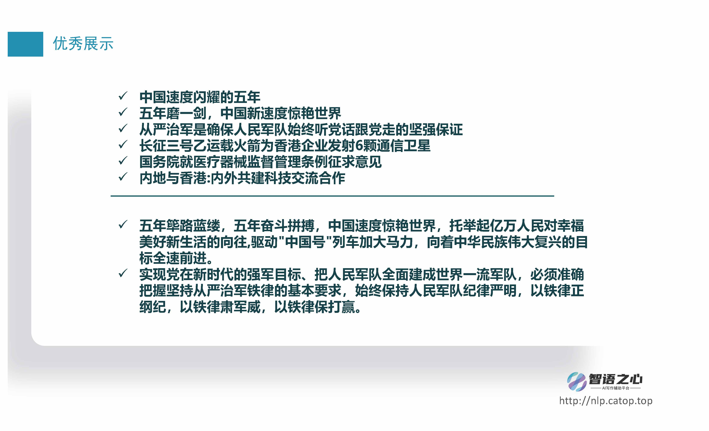

# ZhiYu-NLP
This is the 11th "China Software Cup" competition project, which won the second prize.
The topic is A9-"Intelligent Creation Platform", details of which can be found on the official website of the competition.

## Ideas and Works
+ Based on the GPT-2 language model, it was trained using a dataset of more than 300w pieces organized by ourselves.
+ Optimized the model for production deployment to meet high concurrency requirements.
+ A complete front-end and back-end program was developed, and the back-end GPU nodes were deployed in a distributed manner for automatic load balancing and high availability.

